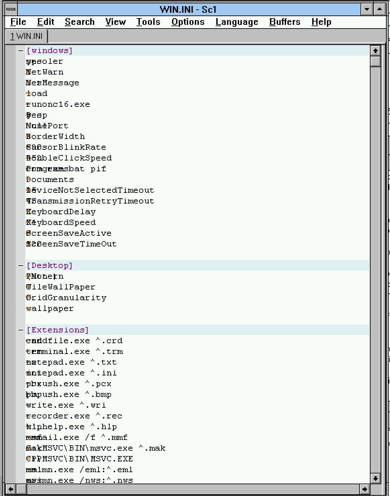

# SciTE 1.77 for old NT versions

Win32s version to run on Windows 3.1ish

# Notes
- Needs ow 2.0 to build
  It has the required fixed to the startup to allow loading the app in NT3.1 and win32s.
  details see https://www.os2museum.com/wp/retro-porting-to-nt-3-1/

- Renamed files to match 8.3 file names (".properties" is now ".pro")

- annoying missing msimm32 dialogs on startup
  Need to fix link but as long as there are bigger issues...

- About dialog generates GP and takes down windows

- Text rendering is incomplete but it changes font when switching between "Use Monospaced" and Normal.

- Text selection does not work

# Preview

